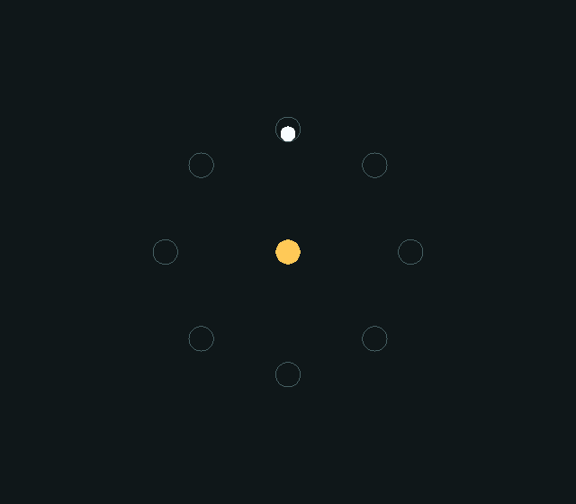
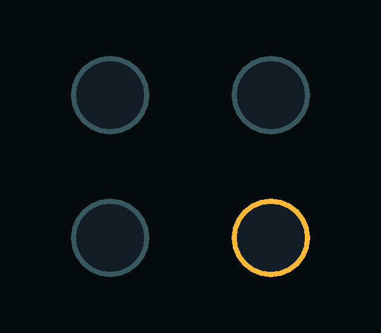
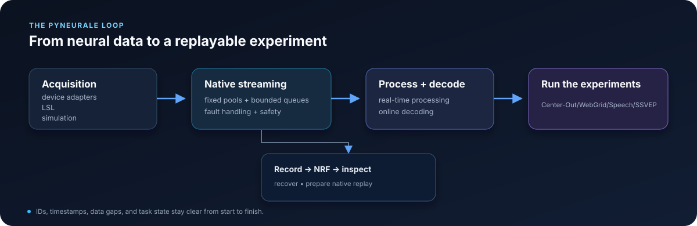

# PyNeurale

[](https://github.com/RanXingchen/pyneurale/actions/workflows/test.yml)
[](https://github.com/RanXingchen/pyneurale/actions/workflows/docs.yml)
[](https://github.com/RanXingchen/pyneurale/blob/main/SUPPORT.md)
[](LICENSE)

**Build closed-loop BCI experiments in Python, with the time-critical stream handled in native code.**

PyNeurale unifies acquisition, signal processing, decoding, experiment control, and data recording in an extensible framework that supports classic BCI paradigms and makes it straightforward to connect new devices through provider adapters or LSL and add new experiments.

[Getting started](docs/getting_started/index.md) ·
[Support matrix](SUPPORT.md)

## Experiments

PyNeurale currently supports Center-Out, WebGrid, SSVEP and Speech tasks. New experiments can reuse acquisition, real-time processing, decoding, and recording components with their own task logic and presentation.

| Center-Out | SSVEP |
| :---: | :---: |
| <a href="docs/user_guide/center_out.md#run-the-demo"></a> | <a href="docs/user_guide/ssvep.md#run-the-demo"></a> |
| Assisted cursor control with online decoder training. [Run the demo](docs/user_guide/center_out.md#run-the-demo). | A online four-target selection based on SSVEP. [Run the demo](docs/user_guide/ssvep.md#run-the-demo). |

## How it fits together



Data and results keep timestamps, channel names, and trial IDs, so you can trace what happened in a run. If a requested device or data type is unavailable, PyNeurale raises an error instead of silently switching paths. See the [architecture](docs/architecture/overview.md) for details.

## What's included

| Capability | Key features |
| --- | --- |
| Acquisition | Connect external devices with provider adapters, ingest LSL streams with the optional `lsl` extra, or use simulation for development. |
| Real-time pipelines | Native streaming, signal processing, feature extraction, and decoding with bounded queues. |
| Experiments | Built-in Center-Out and SSVEP sessions and WebGrid and Speech task APIs; reuse acquisition, processing, decoding, and recording APIs to build new paradigms. |
| Recording and replay | Record, read, inspect, and repair NRF v1 files; prepare replay images in Python and run the native replay source in C++. |
| Data and offline analysis | Typed signals, events, trials, features, spikes, models, and spike sorting. |
| Presentation | Native GLFW/OpenGL windows and input for built-in paradigms, included in the supported desktop wheel profile. |

For exact platform and build support, see the [support matrix](SUPPORT.md).

## Install

PyNeurale supports CPython 3.11 and 3.12. For CPU-heavy real-time pipelines, we recommend a oneMKL-enabled build when available. It provides optimized CPU kernels. Broader CUDA support is in development. See [Getting started](docs/getting_started/index.md) and the [support matrix](SUPPORT.md) for more install details.

### Install a wheel

Install a compatible wheel from the package index:

```bash
python -m pip install --only-binary=pyneurale "pyneurale[nrf,lsl]"
```

The `nrf` and `lsl` extras add recording and LSL dependencies. Supported desktop
wheel profiles include presentation; headless source builds can omit it. MKL,
CUDA, and presentation are fixed when a wheel is built, so extras cannot enable
them later.

### Build from source

To build with oneMKL, recording, LSL, and desktop presentation, install oneMKL, a C++20 compiler, and CMake, then run:

```bash
git clone https://github.com/RanXingchen/pyneurale.git
cd pyneurale
python -m pip install ".[nrf,lsl]" \
  --config-settings=cmake.define.NEURALE_ENABLE_MKL=ON \
  --config-settings=cmake.define.NEURALE_ENABLE_CUDA=OFF \
  --config-settings=cmake.define.NEURALE_ENABLE_EXPERIMENT_PRESENTATION=ON
```

Presentation requires a supported desktop OpenGL setup; use `NEURALE_ENABLE_EXPERIMENT_PRESENTATION=OFF` for headless use. If oneMKL is not installed, use `NEURALE_ENABLE_MKL=OFF` for the portable CPU build.

## Documentation and development

| Start here | Contents |
| --- | --- |
| [User guide](docs/user_guide/index.md) | Data, signals, models, sorting, acquisition, and closed-loop experiments |
| [Python and native API](docs/api/index.md) | Public Python modules and documented C++ APIs |
| [Architecture](docs/architecture/overview.md) | Which layer owns what and how the layers depend on each other |
| [Development](docs/development/index.md) | Builds, tests, benchmarks, streaming, recording, experiments, and presentation |
| [NRF v1 specification](specifications/nrf/v1/README.md) | The exact recording format and its test data |

For development:

```bash
python -m pip install -e ".[dev]" \
  --config-settings=cmake.define.NEURALE_ENABLE_MKL=ON \
  --config-settings=cmake.define.NEURALE_ENABLE_CUDA=ON \
  --config-settings=cmake.define.NEURALE_ENABLE_EXPERIMENT_PRESENTATION=ON
python -m pytest
python tools/build_docs.py --clean
```

See the [development validation guide](docs/development/validation_matrix.md) for native, sanitizer, presentation, wheel, and benchmark checks.

## License

PyNeurale is distributed under the [MIT License](LICENSE).
